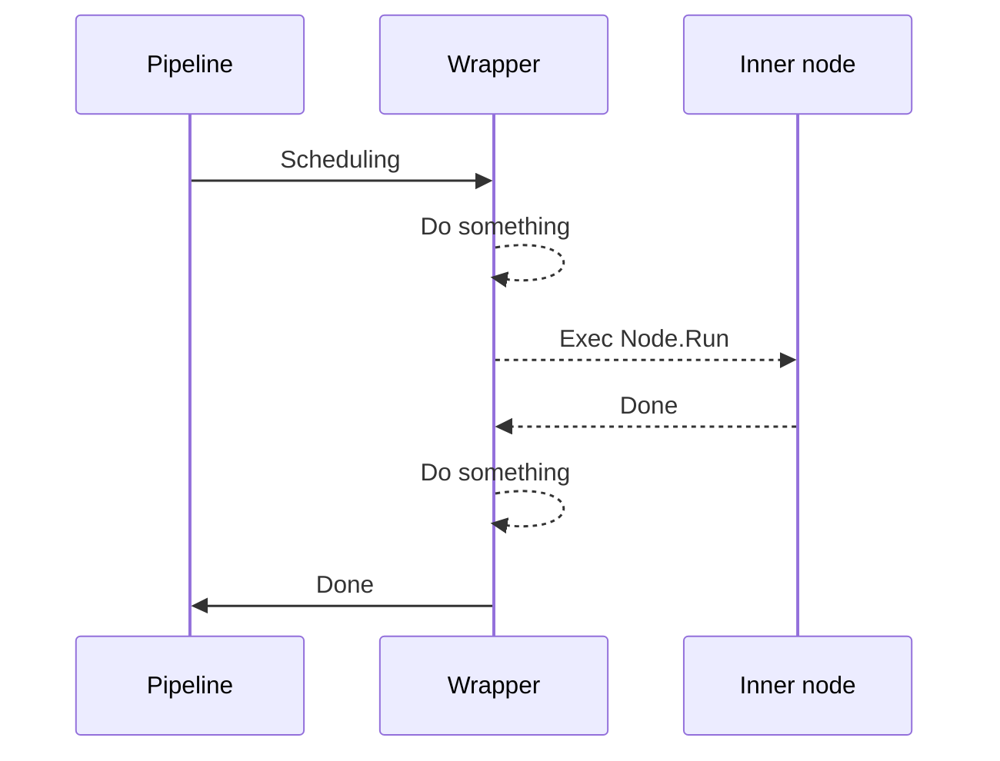

Wrapper is a very important concept in ograph, which can dynamically add functionality to nodes.
 
Currently, many important features are implemented through built-in wrappers. For example, loop execution, timeout control, error retry, and so on. You can also customize wrappers to replace the built-in implementations or implement personalized requirements.

The diagram below illustrates how wrappers work.



If you are still confused, don't worry, you can continue reading to learn about how to use built-in wrappers and customize wrappers.

## Built-in wrapper

ograph includes many useful wrappers built-in. To use them is very simple, here take retry wrapper as an example, explain how to use the built-in wrappers.

For more specific documentation, please refer to the reference.

```go
func TestWrapper_Retry(t *testing.T) {
	var failedCnt int

	learningToWalk := func() error {
		if failedCnt < 3 {
			failedCnt++
			return errors.New("fallen")
		}

		fmt.Println("Wow!")
		return nil
	}

	pipeline := ograph.NewPipeline()

	baby := ograph.NewElement("Baby").UseFn(learningToWalk).Apply(ogimpl.RetryOp(99))
	// equals to Wrap(ogimpl.Retry).Params("MaxRetryTimes", 99)

	pipeline.Register(baby)

	if err := pipeline.Run(context.TODO(), nil); err != nil {
		t.Error(err)
	}
}
```

**Output**

```
2025/02/24 23:43:31 WARN retry failed node NodeName=Baby Error=fallen
2025/02/24 23:43:31 WARN retry failed node NodeName=Baby Error=fallen
2025/02/24 23:43:31 WARN retry failed node NodeName=Baby Error=fallen
Wow!
```

The most important is `Apply(ogimpl.RetryOp(99))` , which means adding retry functionality to the node and the maximum number of retries is 99.

This is equivalent to the general write method ` Wrap(ogimpl.Retry).Params("MaxRetryTimes", 99)`. The former is a more convenient write method.

## Custom wrapper

**Define a wrapper**

```go
type CustomWrapper struct {
	ograph.BaseWrapper
}

func (wrapper *CustomWrapper) Run(ctx context.Context, state ogcore.State) error {
	fmt.Println("Before node start") // you can do something here

	wrapper.Node.Run(ctx, state)

	fmt.Println("After node finish") // you can do something here

	return nil
}

func NewCustomWrapper() ogcore.Node {
	return &CustomWrapper{}
}
```

Define a wrapper like defining a node, but it must implement the `Wrap(node ogcore.Node)` method. The example inherits from `ograph.BaseWrapper`, so you don't need to implement it yourself.

**Use in the pipeline**

```go
func TestWrapper_Customize(t *testing.T) {
	pipeline := ograph.NewPipeline()

	pipeline.RegisterFactory("MyWrapper", NewCustomWrapper)

	innerNode := ograph.NewElement("InnerNode").
		UseFn(func() error {
			fmt.Println("Inner node running")
			return nil
		}).
		Wrap("MyWrapper")

	pipeline.Register(innerNode)

	if err := pipeline.Run(context.TODO(), nil); err != nil {
		t.Error(err)
	}
}
```

1. Register [factory](./factory.md) of wrapper.
2. Wrap inner node by `Wrap("MyWrapper")`.

**Output**
```
Before node start
InnerNode failed.
After node finish
```

## Combine multiple wrappers

You can wrap multiple wrappers around the same node. For example:

```go
	ograph.NewElement("InnerNode").
		Apply(ogimpl.DelayOp(time.Second), ogimpl.LoopOp(3)).
		Wrap(ogimpl.Debug).Wrap("MyWrapper")
```

