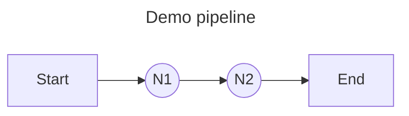
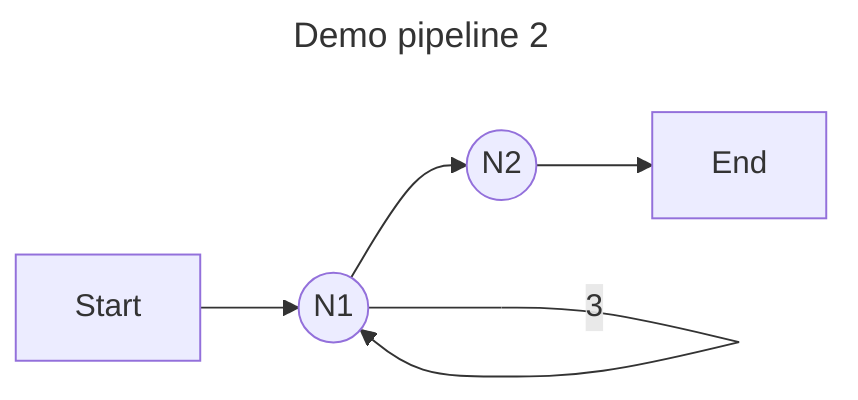
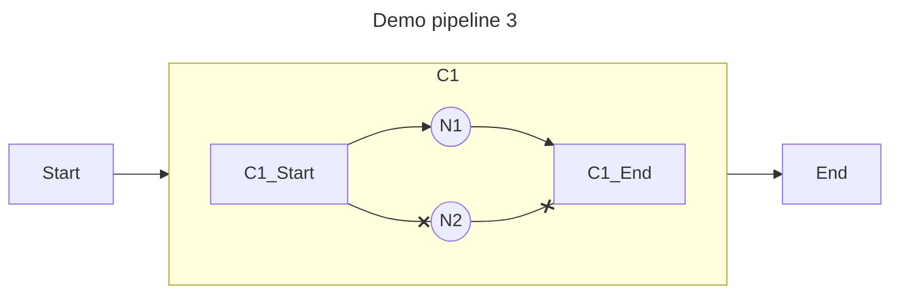

## Install

```shell
go get github.com/symphony09/ograph
```

## Demo


func TestDemo(t *testing.T) {
	pipeline := ograph.NewPipeline()

	n1 := ograph.NewElement("N1").UseFn(func() error {
		fmt.Println("N1 running")
		return nil
	})
	n2 := ograph.NewElement("N2").UseFn(func() error {
		fmt.Println("N2 running")
		return nil
	})

	pipeline.Register(n1).
		Register(n2, ograph.Rely(n1))

	if err := pipeline.Run(context.TODO(), nil); err != nil {
		t.Error(err)
	}
}


As shown in lines 13 to 14 of the code, two nodes are registered in the pipeline, and N2 is dependent on N1.



**Output**

```
N1 running
N2 running
```

## Loop


{}

```go
// ...
n1 := ograph.NewElement("N1").UseFn(func() error {
		fmt.Println("N1 running")
		return nil
	}).Apply(ogimpl.LoopOp(3)) // Execute N1 3 times in a loop.
// ...
```

{}

{}

```go
func TestDemo2(t *testing.T) {
	pipeline := ograph.NewPipeline()

	n1 := ograph.NewElement("N1").UseFn(func() error {
		fmt.Println("N1 running")
		return nil
	}).Apply(ogimpl.LoopOp(3)) // Execute N1 3 times in a loop.

	n2 := ograph.NewElement("N2").UseFn(func() error {
		fmt.Println("N2 running")
		return nil
	})

	pipeline.Register(n1).
		Register(n2, ograph.Rely(n1))

	if err := pipeline.Run(context.TODO(), nil); err != nil {
		t.Error(err)
	}
}
```

{}




The loop is executed through the [Wrapper](features/wrapper.md), which implements functions such as conditional execution, timeout control, and error retry.

## Choose


{}

```go
	// ...
	c := ograph.NewElement("C1").UseFactory(ogimpl.Choose, n1, n2).Params("ChooseExpr", "index")
	
	pipeline.Register(c)

	state := ograph.NewState()
	state.Set("index", 1) // choose node by index

	if err := pipeline.Run(context.TODO(), state); err != nil {
		t.Error(err)
	}
```

{}

{}

```go
func TestDemo3(t *testing.T) {
	pipeline := ograph.NewPipeline()

	n1 := ograph.NewElement("N1").UseFn(func() error {
		fmt.Println("N1 running")
		return nil
	})
	n2 := ograph.NewElement("N2").UseFn(func() error {
		fmt.Println("N2 running")
		return nil
	})

	c := ograph.NewElement("C1").UseFactory(ogimpl.Choose, n1, n2).Params("ChooseExpr", "index")

	pipeline.Register(c)

	state := ograph.NewState()
	state.Set("index", 1) // choose node by index

	if err := pipeline.Run(context.TODO(), state); err != nil {
		t.Error(err)
	}
}
```

{}




This function is implemented through [Cluster](features/cluster.md), and other functions such as race execution are also implemented through `Cluster`.

## Use Node & Factory

The previous demo showed the simplest usage method. Further, you can use nodes or factories as pipeline elements to execute logic.

**Declare a node**
```go
type Printer struct {
	ograph.BaseNode //  Inherit the base node.
}

func (printer *Printer) Run(ctx context.Context, state ogcore.State) error {
	// Inherit the Name method from the base node.
	// Return the name set in the pipeline element (NewElement("N1")).
	fmt.Printf("[%s running]\n", printer.Name()) // [N1 running]

	// Get data from state by key.
	fmt.Println(state.Get("key"))
	return nil
}
```

**Use node in element**
```go
n1 := ograph.NewElement("N1").UseNode(&Printer{})
```

Using `UseFn` and `UseNode` is essentially a singleton pattern, and it is recommended to use the factory pattern in OGraph. More details is [here](features/factory.md).

**Declare a factory**

```go
pipeline.RegisterFactory("PrinterFactory", func() ogcore.Node {
		return &Printer{}
	})
```

**Use factory in element**

```go
n1 := ograph.NewElement("N1").UseFactory("PrinterFactory")
n2 := ograph.NewElement("N2").UseFactory("PrinterFactory")
```