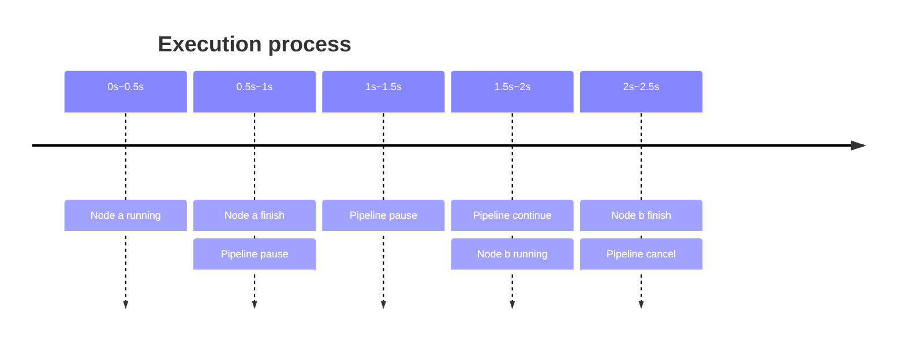

## 示例

OGraph Pipeline 支持暂停运行、继续运行和取消运行，示例代码如下：

```go
	pipeline := ograph.NewPipeline()

	var startTime time.Time

	a := ograph.NewElement("a").UseFn(func() error {
		fmt.Println("a running")
		startTime = time.Now()
		time.Sleep(time.Second)
		return nil
	})

	b := ograph.NewElement("b").UseFn(func() error {
		fmt.Println("b running, after", time.Since(startTime))
		time.Sleep(time.Second)
		return nil
	})

	c := ograph.NewElement("c").UseFn(func() error {
		fmt.Println("c running, after", time.Since(startTime))
		return nil
	})

	pipeline.Register(a).Register(b, ograph.Rely(a)).Register(c, ograph.Rely(b))

	ctx, cancel := context.WithCancel(context.Background())

	pause, continueRun, wait := pipeline.AsyncRun(ctx, nil)

	time.Sleep(time.Millisecond * 500)

	pause() // pause before run node b

	time.Sleep(time.Second)

	continueRun() // b continue run, after 1.5s (0.5+1), not 1s

	time.Sleep(time.Millisecond * 500)

	cancel() // cancel before run node c, so node c will never be ran

	err := wait() // wait pipeline finish

	fmt.Println(err) // should get context canceled err
```

## 流程图

示例代码运行过程如下：



