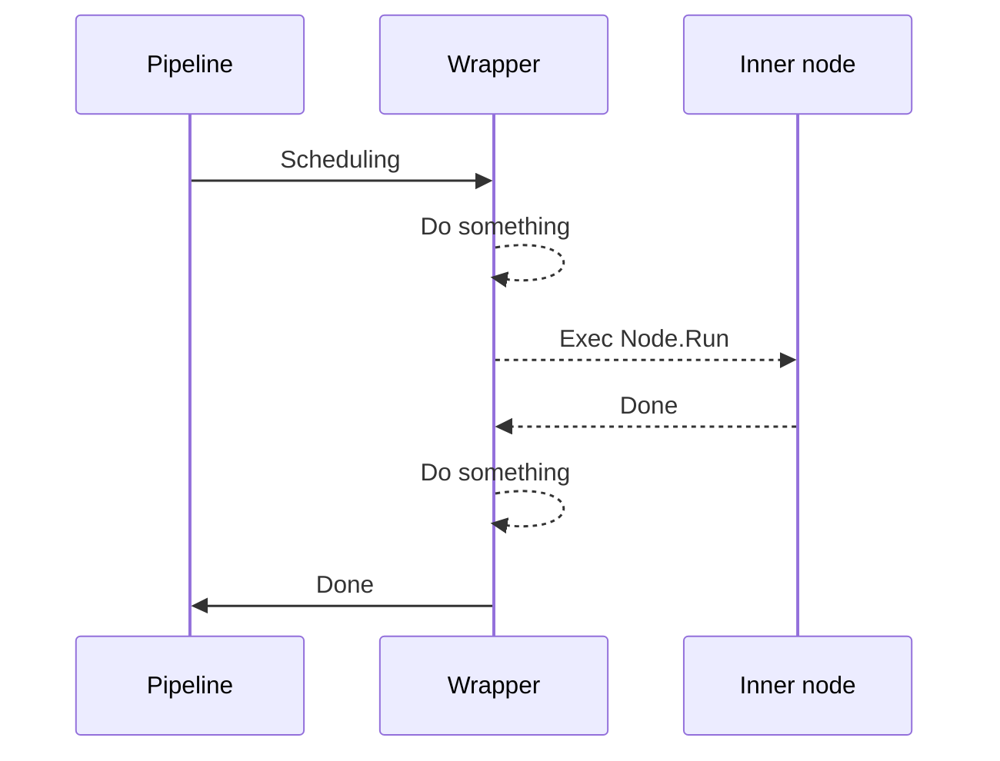

包装器是 ograph 中一个非常重要的概念，可以动态地为节点添加功能。

目前，许多重要特性是通过内置的包装器实现的。例如，循环执行、超时控制、错误重试等。你也可以自定义包装器来替换内置实现或满足个性化需求。

下图说明了包装器的工作原理。



如果你仍然感到困惑，不要担心，你可以继续阅读以了解如何使用内置的包装器以及如何自定义包装器。

## 内置包装器

ograph 包含许多内置的实用包装器。使用它们非常简单，这里以重试包装器为例，解释如何使用内置的包装器。

更多具体文档，请参阅[参考文档](../reference/)。

```go
func TestWrapper_Retry(t *testing.T) {
    var failedCnt int

    learningToWalk := func() error {
        if failedCnt < 3 {
            failedCnt++
            return errors.New("fallen")
        }

        fmt.Println("Wow!")
        return nil
    }

    pipeline := ograph.NewPipeline()

    baby := ograph.NewElement("Baby").UseFn(learningToWalk).Apply(ogimpl.RetryOp(99))
    // equals to Wrap(ogimpl.Retry).Params("MaxRetryTimes", 99)

    pipeline.Register(baby)

    if err := pipeline.Run(context.TODO(), nil); err != nil {
        t.Error(err)
    }
}
```

**Output**

```
2025/02/24 23:43:31 WARN retry failed node NodeName=Baby Error=fallen
2025/02/24 23:43:31 WARN retry failed node NodeName=Baby Error=fallen
2025/02/24 23:43:31 WARN retry failed node NodeName=Baby Error=fallen
Wow!
```

最重要的是 `Apply(ogimpl.RetryOp(99))`，这意味着为节点添加重试功能，并且最大重试次数为 99。

这等同于通用写法 `Wrap(ogimpl.Retry).Params("MaxRetryTimes", 99)`。前者是一种更方便的写法。

## 自定义包装器

**定义包装器**

```go
type CustomWrapper struct {
    ograph.BaseWrapper
}

func (wrapper *CustomWrapper) Run(ctx context.Context, state ogcore.State) error {
    fmt.Println("Before node start") // you can do something here

    wrapper.Node.Run(ctx, state)

    fmt.Println("After node finish") // you can do something here

    return nil
}

func NewCustomWrapper() ogcore.Node {
    return &CustomWrapper{}
}
```

定义一个包装器就像定义一个节点一样，但必须实现 `Wrap(node ogcore.Node)` 方法。例子中的包装器继承自 `ograph.BaseWrapper`，因此不需要再实现它。

**在 pipeline 中使用**

```go
func TestWrapper_Customize(t *testing.T) {
    pipeline := ograph.NewPipeline()

    pipeline.RegisterFactory("MyWrapper", NewCustomWrapper)

    innerNode := ograph.NewElement("InnerNode").
        UseFn(func() error {
            fmt.Println("Inner node running")
            return nil
        }).
        Wrap("MyWrapper")

    pipeline.Register(innerNode)

    if err := pipeline.Run(context.TODO(), nil); err != nil {
        t.Error(err)
    }
}
```

1. 注册包装器的工厂（参见[工厂](./factory.md)）。
2. 使用 `Wrap("MyWrapper")` 包装内部节点。

**输出**
```
Before node start
InnerNode failed.
After node finish
```

## 联合使用多个包装器

你可以为同一个节点添加多个包装器。例如：

```go
    ograph.NewElement("InnerNode").
        Apply(ogimpl.DelayOp(time.Second), ogimpl.LoopOp(3)).
        Wrap(ogimpl.Debug).Wrap("MyWrapper")
```

