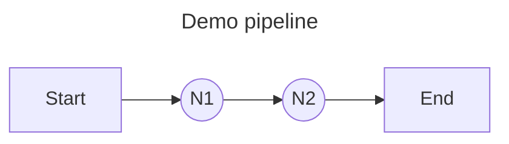
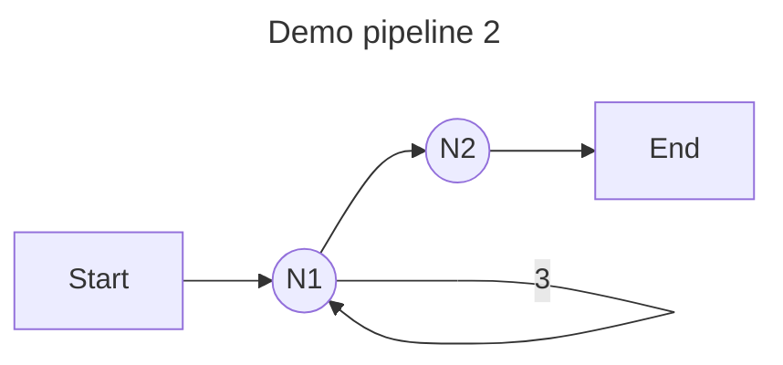
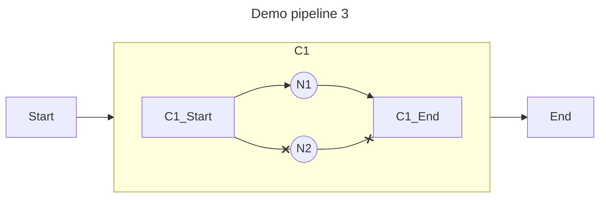

## 安装

```shell
go get github.com/symphony09/ograph
```

## 演示


func TestDemo(t *testing.T) {
    pipeline := ograph.NewPipeline()

    n1 := ograph.NewElement("N1").UseFn(func() error {
        fmt.Println("N1 running")
        return nil
    })
    n2 := ograph.NewElement("N2").UseFn(func() error {
        fmt.Println("N2 running")
        return nil
    })

    pipeline.Register(n1).
        Register(n2, ograph.Rely(n1))

    if err := pipeline.Run(context.TODO(), nil); err != nil {
        t.Error(err)
    }
}


如代码的第13到14行所示，有两个节点被注册到了管道中，并且N2依赖于N1。



**输出**

```
N1 running
N2 running
```

## 循环执行


{}

```go
// ...
n1 := ograph.NewElement("N1").UseFn(func() error {
        fmt.Println("N1 running")
        return nil
    }).Apply(ogimpl.LoopOp(3)) // 在循环中执行 N1 三次。
// ...
```

{}

{}

```go
func TestDemo2(t *testing.T) {
    pipeline := ograph.NewPipeline()

    n1 := ograph.NewElement("N1").UseFn(func() error {
        fmt.Println("N1 running")
        return nil
    }).Apply(ogimpl.LoopOp(3)) // 在循环中执行 N1 三次。

    n2 := ograph.NewElement("N2").UseFn(func() error {
        fmt.Println("N2 running")
        return nil
    })

    pipeline.Register(n1).
        Register(n2, ograph.Rely(n1))

    if err := pipeline.Run(context.TODO(), nil); err != nil {
        t.Error(err)
    }
}
```

{}




循环通过 [Wrapper](features/wrapper.md) 实现, 还可以用来实现条件执行, 超时控制, 错误重试等功能.

## 选择执行


{}

```go
    // ...
    c := ograph.NewElement("C1").UseFactory(ogimpl.Choose, n1, n2).Params("ChooseExpr", "index")
    
    pipeline.Register(c)

    state := ograph.NewState()
    state.Set("index", 1) // 通过 index 值选择节点

    if err := pipeline.Run(context.TODO(), state); err != nil {
        t.Error(err)
    }
```

{}

{}

```go
func TestDemo3(t *testing.T) {
    pipeline := ograph.NewPipeline()

    n1 := ograph.NewElement("N1").UseFn(func() error {
        fmt.Println("N1 running")
        return nil
    })
    n2 := ograph.NewElement("N2").UseFn(func() error {
        fmt.Println("N2 running")
        return nil
    })

    c := ograph.NewElement("C1").UseFactory(ogimpl.Choose, n1, n2).Params("ChooseExpr", "index")

    pipeline.Register(c)

    state := ograph.NewState()
    state.Set("index", 1) // 通过 index 值选择节点

    if err := pipeline.Run(context.TODO(), state); err != nil {
        t.Error(err)
    }
}
```

{}




选择执行通过 [Cluster](features/cluster.md) 实现, 其他还有竞争执行等也是通过 `Cluster` 实现.

## 使用节点及工厂

之前的演示展示了最简单的使用方法。进一步地，你可以使用节点或工厂作为管道元素来执行逻辑。

**声明一个节点**
```go
type Printer struct {
    ograph.BaseNode //  继承基础节点。
}

func (printer *Printer) Run(ctx context.Context, state ogcore.State) error {
    // 继承基础节点的Name方法。
    // 返回在管道元素中设置的名字（例如 NewElement("N1")）。
    fmt.Printf("[%s running]\n", printer.Name()) // [N1 running]

    // 通过键从状态中获取数据。
    fmt.Println(state.Get("key"))
    return nil
}
```

代码涉及使用`State`，请参阅[State](./features/state.md)以获取相关文档。

**在元素中使用节点**
```go
n1 := ograph.NewElement("N1").UseNode(&Printer{})
```

使用`UseFn`和`UseNode`本质上是单例模式，建议在OGraph中使用工厂模式。更多详情请参阅[Factory](features/factory.md)。

**声明一个工厂**

```go
pipeline.RegisterFactory("PrinterFactory", func() ogcore.Node {
        return &Printer{}
    })
```

**在元素中使用工厂**

```go
n1 := ograph.NewElement("N1").UseFactory("PrinterFactory")
n2 := ograph.NewElement("N2").UseFactory("PrinterFactory")
```